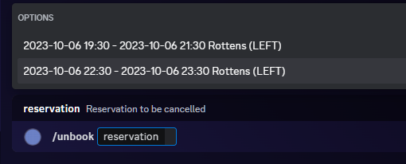
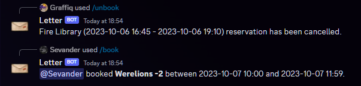
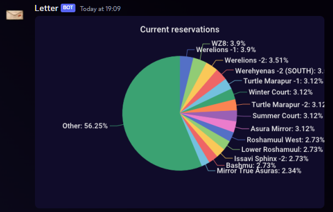
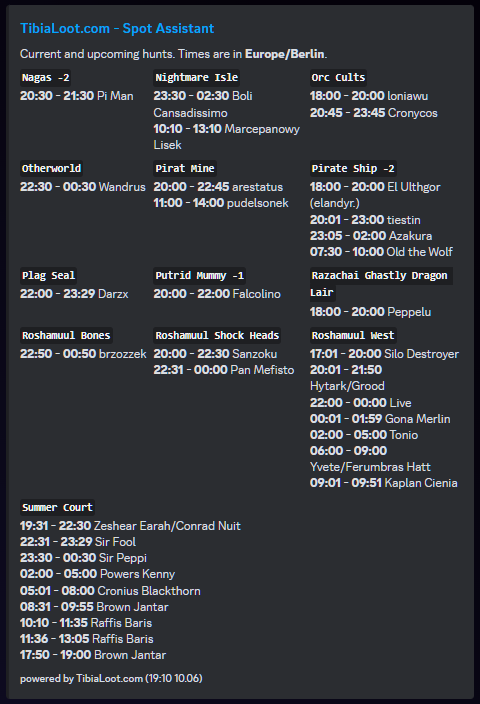

# Letter, Tibia's booking bot

---

Letter is a Discord bot for reserving respawns in [Tibia](https://tibia.com). It registers slash commands allowing users to manage their respawn bookings.  
Currently used by servers with over 3k members. 

---

  
If you like the bot and want to support its development, you can buy me a coffee!
---
## Overview
* [**LICENSE**](LICENSE)
* [Invite link, self-hosting](#Invite-link-self-hosting)
* [Trivia](#Trivia)
* [**Screenshots**](#Screenshots)
  * [Booking](#Booking)
  * [Unbooking](#Unbooking)
  * [Feedback](#Feedback)
  * [Pie chart showing distribution of reservations](#Pie-chart-showing-distribution-of-reservations)
  * [List of upcoming reservations](#List-of-upcoming-reservations)
* [**Development**](#Development)

--- 
## Invite link, self-hosting

**Hosted version is available on demand**. Reach out on [Tibialoot Discord Server](https://discord.com/invite/F4YKgsnzmc). 

Self-hosting is possible but it's your job to figure out how you want it done. If you require support, hit us up [Tibialoot Discord Server](https://discord.com/invite/F4YKgsnzmc).

## Trivia

Letter bot originated within [Refugees](https://www.tibia.com/community/?subtopic=guilds&page=view&GuildName=Refugees), the dominating guild on one of the oldest Tibia servers, Celesta.

## Screenshots

### Booking

### Unbooking

### Feedback

### Pie chart showing distribution of reservations

## List of upcoming reservations

## Development

### Prerequisites

* `docker` and `docker-compose` (unless you want to go bare-metal),
* `make` (unless you want to run commands manually),
* `go` (if you want to develop),
* `atlas` to manage migrations https://atlasgo.io
* `sqlc` to generate Go wrappers around SQL queries https://sqlc.dev/

### docker-compose

#### Initial setup

1. Copy `.env.example` to `.env` and fill in the values (or leave as-is).
3. Run `docker-compose up -d` to start the stack.
4. Run `docker-compose exec bot sh -c "bin/migrate"` to apply migrations.
4. Run `docker-compose exec db bash -c "seed"` to fill any entry-level data.
5. Run `docker-compose restart bot` (as it failed originally, when the database was not set up).

#### After initial setup

1. To start: `docker-compose up -d`
2. Development should hot reload (recompile and restart the bot) on file changes.
2. To stop:`docker-compose stop` or `... down`

#### Shutdown / teardown

1. To shut the service down, `docker-compose stop`
2. (optional) To remove containers and networks, `docker-compose down`
2. (optional) To remove the volumes, such as database, `docker volume rm letter_bot_postgres`

### Database and migrations

* make changes in schema, 
* `bin/generate_migration <migration_title>`
* create new queries, if needed
* `make sqlc-generate`

To apply migrations, run `docker-compose exec bot sh -c "bin/migrate"`.

### Contributing

We will be very happy for each contribution. 

1. Fork the repository
2. Create a branch with your changes
3. Push the branch to your fork
4. Create a pull request
5. Wait for the review

### TibiaData integration

The bot has [TibiaData](https://tibiadata.com/) integration, which allows for showing online/offline indicators for players with reservations.

In order to enable it, you need to set the `TIBIADATA_API_KEY` environment variable. 

There are examples in [.env.sample](.env.sample) file, along with [docker-compose.yml](docker-compose.yml).

## Credits
Letter-bot is one of many tools prototyped by (and for) [TibiaLoot.com](https://tibialoot.com)  

Author: [marahin](https://github.com/marahin)

Contributors: 

* [patryk-fuhrman](https://github.com/patryk-fuhrman)
* [pawcioma](https://github.com/pawcioma/)
* [mariyusz](https://github.com/mariyusz)
